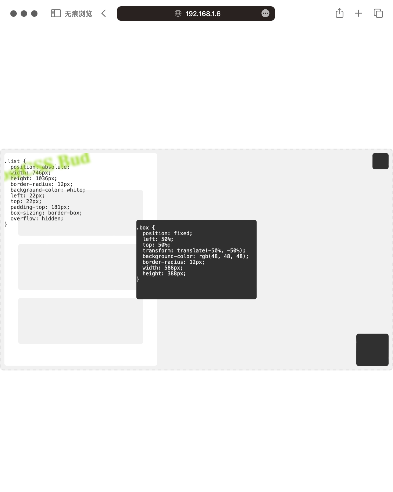

# postcss-bud


一款 PostCSS 插件，用于保持视图横竖居中于屏幕。

## 安装

npm 安装：
```bash
npm install --save-dev postcss postcss-bud
```

yarn 安装：
```bash
yarn add -D postcss postcss-bud
```

<details>
<summary>
安装之后在 postcss.config.js 配置文件中引入，或者其它框架配置文件中引入。
</summary>

```javascript
import dataScreen from 'postcss-mobile-forever' // <---- 这里
import autoprefixer from 'autoprefixer'
// 省略……
{
	postcss: {
		plugins: [
			autoprefixer(),
			dataScreen({ // <---- 这里
				rootSelector: '#app',
				viewport: {
          width: 1920,
          height: 1080,
        },
			}),
		],
	},
}
// 省略……
```
</details>

## 演示效果

下面的动图展示了使用本插件后，左右半屏，上下半屏，以及全屏下，视图始终居中的效果：

<table>
	<tr>
		<td></td>
		<td></td>
	</tr>
	<tr>
		<td colspan="2"></td>
	</tr>
</table>

<details>
<summary>
查看动图，动图展示了拖拽窗口，视图始终居中的效果。
</summary>

</details>

在“范例”一节查看，源码中提供了范例，用于在本地运行后验证演示效果，或者您也可以查看文档开头的在线范例。

## 配置参数

| Name | Type | isRequired | Default | Desc |
|:--|:--|:--|:--|:--|
| viewport | number\|(file: string, selector: string) => { width: number; height: number; } | N | 750 | 设计图宽度，可以传递函数动态生成设计图宽度，例如 `file => file.includes("vant") ? 375 : 750` 表示在名称包含“vant”的文件内使用 375 的设计图宽度 |
| viewport.width | number | N | 1920 | 设计图宽度 |
| viewport.height | number | N | 1920 | 设计图宽度 |
| rootSelector | string | N | null | 根元素选择器，如果指定，则将制定选择器居中 |
| unitPrecision | number | N | 3 | 精确到小数点后几位？ |
| comment.vars | string | N | null | 自定义注释，定义全局变量的注释名称，如果未指定，将判断是否设置根元素选择器，如果设置，全局变量定义在根选择器处，如果未设置，将定义在每个 css 文件开头|
| comment.ignorePrev | string | N | null | 自定义注释，标记则不对当前行进行转换 |
| exclude | RegExp\|RegExp[] | N | null | 排除文件或文件夹，哪些文件不需要转换？ |
| include | RegExp\|RegExp[] | N | null | 包括文件或文件夹，哪些文件需要转换？ |

下面是默认的配置参数：

```json
{
  "viewport": {
    "width": 1920,
    "height": 1080,
  },
  "rootSelector": null,
  "unitPrecision": 3,
  "comment": {
    "vars": null,
    "ignorePrev": null,
  },
  "include": null,
  "exclude": null
}
```

## 单元测试

```bash
npm install
npm run test
```

## 范例

文件夹 `example` 内提供了分别在 [React](https://reactjs.org/) 中使用 `postcss-bud` 的范例，通过命令行进入对应的范例文件夹中，即可运行：

```bash
cd example/react/
npm install
npm run start
```

在“演示效果”一节中查看成功运行之后，不同屏幕尺寸的图片。

## 原理和输入输出

视图宽度：`min(calc(100vh * viewportWidth / viewportHeight), 100vw)`

视图高度：`min(calc(100vw * viewportHeight / viewportWidth), 100vh)`

输入：

```css
.petal {
  width: 1920px;
  height: 540px;
}

.bud {
  width: 36px;
  height: 36px;
  position: fixed;
  bottom: 0;
  right: 0;
}
```

输出：

```css
:root {
  --vW: min(calc(100vh * 1.778), 100vw); /* viewport width，min(calc(100vh * 1920 / 1080), 100vw) */
  --vH: min(calc(100vw * 0.563), 100vh); /* viewport height，min(calc(100vw * 1080 / 1920), 100vh) */
  --yE: calc(50% - var(--vH) / 2); /* column edge space */
  --xE: calc(50% - var(--vW) / 2); /* row edge space */
}

.petal {
  width : calc(var(--vW) * 1);
  height: calc(var(--vH) * 0.5);
}

.bud {
  width   : calc(var(--vW) * 0.019);
  height  : calc(var(--vH) * 0.033);
  position: fixed;
  bottom  : var(--yE);
  right   : var(--xE);
}
```

## CHANGELOG

查看[更新日志](./CHANGELOG.md)。

## 版本规则

查看[语义化版本 2.0.0](https://semver.org/lang/zh-CN/)。

## 协议

查看 [MIT License](./LICENSE)。

## 其它

相关链接：
- [postcss-mobile-forever](https://github.com/wswmsword/postcss-mobile-forever)，一款 PostCSS 插件，用于转换视口单位，限制视图最大宽度，生成屏幕媒体查询，让移动端视图处处可访问。